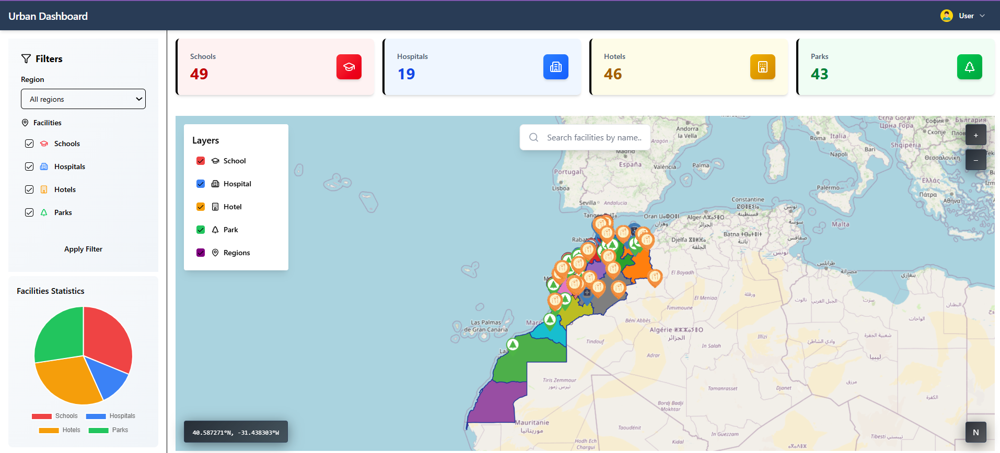

# 🌍 Urban Dashboard

A modern, interactive geographic information system (GIS) application for visualizing and analyzing urban facilities across regions. Built with React, OpenStreetMap, and PostGIS spatial database, Urban Dashboard provides real-time statistics, advanced filtering, and an intuitive interface for exploring urban infrastructure.

## ✨ Features

### 📊 **Interactive Dashboard**
- **Dynamic KPI Cards**: Real-time metrics for schools, hospitals, hotels, and parks
- **Statistics Charts**: 
  - Bar charts for regional comparisons
  - Pie charts showing facility distribution
  - Charts update dynamically based on applied filters
- **Filter Sidebar**: Region and facility type selection with visual feedback
- **Search Functionality**: Find facilities by name across the map

### 🗺 **Advanced Interactive Map**
- Built on **OpenStreetMap** with OpenLayers rendering
- Display multiple facility layers (schools, hospitals, hotels, parks)
- **Region boundaries** shown as interactive polygons
- **Layer control** to toggle facility visibility
- **Auto-zoom** to selected region with smooth animation
- **Feature details dialog** with rich information on click
- **Spatial filtering** by region with geometric intersection

### 🔐 **Secure Authentication**
- JWT-based authentication system
- Protected routes and role-based access control
- User profile management
- Session persistence

### 📈 **Spatial Analysis**
- Filter facilities by geographic region
- View statistics specific to selected areas
- Automatic geographic boundary highlighting
- PostGIS-powered spatial queries

## 🚀 Quick Start

### Prerequisites
- Node.js 18+ and npm/yarn
- A Supabase account with PostGIS enabled
- Basic understanding of React and GIS concepts

### Installation

1. **Clone the repository**
```bash
git clone https://github.com/hafsa2022/Urban_Dashboard.git
cd Urban_Dashboard
```

2. **Install client dependencies**
```bash
cd client
npm install
```

4. **Configure environment variables**

Create a `.env` file in the `client` directory:
```env
VITE_SUPABASE_URL=https://your-project.supabase.co
VITE_SUPABASE_PUBLISHABLE_KEY=your_publishable_key
```

5. **Setup Database**

Execute the SQL migration script in `server/sql/add_region_id.sql` in your Supabase database to:
- Add `region_id` column to facility tables
- Create spatial indexes for optimal performance
- Populate region associations based on geometry

6. **Start the development server**
```bash
cd client
npm run dev
```

The application will be available at `http://localhost:5173`

## 📖 Usage

### Filtering Facilities
1. Open the filter sidebar on the left
2. Select a region from the dropdown
3. Toggle facility types (School, Hospital, Hotel, Park)
4. Click "Apply Filters" to see results
5. The map automatically zooms to the selected region

### Exploring the Map
- **Click a facility marker** to view detailed information
- **Zoom controls** available for navigation
- **Layer switcher** to show/hide facility types
- **Coordinates display** shows current cursor location
- **Search bar** to find facilities by name

### Viewing Statistics
- Statistics automatically update when filters are applied
- Charts show distribution by facility type
- Reset filters button returns to default view

## 🏗 Project Structure

```
Urban_Dashboard/
├── client/                          # React frontend application
│   ├── src/
│   │   ├── components/
│   │   │   ├── dashboard/           # Dashboard components
│   │   │   │   ├── FilterSidebar.jsx
│   │   │   │   ├── KpiCards.jsx
│   │   │   │   ├── SearchBar.jsx
│   │   │   │   └── StatsCharts.jsx
│   │   │   ├── map/                 # Map components
│   │   │   │   ├── Map.jsx
│   │   │   │   ├── MapContentLoader.jsx
│   │   │   │   ├── MapInteraction.jsx
│   │   │   │   ├── FeatureDetailsDialog.jsx
│   │   │   │   ├── FeaturePopup.jsx
│   │   │   │   └── controls/
│   │   │   │       ├── ZoomControl.jsx
│   │   │   │       ├── RotateNorthControl.jsx
│   │   │   │       ├── LayerSwitcherControl.jsx
│   │   │   │       └── CoordinatesControl.jsx
│   │   │   ├── ui/                  # Reusable UI components
│   │   │   ├── NavBar.jsx
│   │   │   └── ProtectedRoute.jsx
│   │   ├── hooks/                   # Custom React hooks
│   │   │   ├── useAuth.js
│   │   │   ├── useFacilities.js
│   │   │   └── MapContext.js
│   │   ├── pages/                   # Page components
│   │   │   ├── Dashboard.jsx
│   │   │   ├── Auth.jsx
│   │   │   ├── Profile.jsx
│   │   │   └── NotFound.jsx
│   │   ├── constants/               # Configuration & constants
│   │   │   ├── layers.js
│   │   │   ├── loadRegionsLayer.js
│   │   │   └── regionsCode.js
│   │   ├── utils/
│   │   │   └── supabase.js          # Supabase client
│   │   └── lib/
│   │       └── utils.js
│   ├── package.json
│   └── vite.config.js
│
├── server/                          # Express backend (optional)
│   ├── routes/
│   ├── controllers/
│   ├── middleware/
│   ├── sql/                         # Database migrations
│   │   ├── auth.sql
│   │   ├── add_region_id.sql
│   │   └── spatial_functions.sql
│   └── package.json
│
└── IMPLEMENTATION_GUIDE.md          # Detailed implementation notes
```

## 🛠 Tech Stack

### Frontend
- **React 19** - UI framework
- **Vite 7** - Build tool & dev server
- **OpenLayers 10** - Map rendering engine
- **Tailwind CSS 4** - Styling
- **React Router 7** - Client-side routing
- **Chart.js & react-chartjs-2** - Statistics visualization
- **Supabase JS Client** - Backend integration
- **Framer Motion** - Animations
- **Zod** - Schema validation

### Backend & Database
- **Supabase** - Backend-as-a-Service (Auth + Database)
- **PostgreSQL** - Relational database
- **PostGIS** - Spatial database extension
- **Express.js** - API server (optional)

### Development Tools
- **ESLint** - Code linting
- **Tailwind CSS** - Utility-first CSS framework

## 📊 Database Schema

### Facilities Tables
```sql
facilities_geojson (view/table)
├── id (UUID)
├── name (text)
├── type (text) - 'school' | 'hospital' | 'hotel' | 'park'
├── geom (geometry(Point, 4326))
├── region_id (integer) - Foreign key to regions
├── properties (jsonb)
```

### Regions Table
```sql
regions
├── ogc_fid (integer) - Primary key
├── nom_region (text) - Region name
├── code_region (text)
├── geom (geometry(Polygon, 4326))
├── populations (Double Precision)
└── [other geographic properties]
```

## 🔄 Data Flow

```
User Interface
    ↓
Filter Selection (Region + Equipment Types)
    ↓
FilterSidebar.applyFilters()
    ↓
Supabase Query (facilities_geojson with region_id filter)
    ↓
Map Rendering (MapContentLoader updates layers)
    ↓
Statistics Update (StatsCharts recalculates)
    ↓
Auto-zoom to Region Extent
```

## 🎯 Key Features in Detail

### Spatial Filtering
- Uses PostGIS geometric operations to filter facilities by region
- Query example:
```sql
SELECT * FROM facilities_geojson
WHERE region_id = :regionId
AND type = ANY(ARRAY[:types])
```

### Real-time Statistics
- Facilities data updates dynamically based on selected region
- Three visualization types: KPI cards, bar charts, pie charts
- Charts powered by Chart.js for performance

### Interactive Map Controls
- **Zoom Control**: Zoom in/out with animated transitions
- **Rotate North**: Reset map rotation
- **Coordinates**: Display cursor coordinates
- **Layer Switcher**: Toggle facility layer visibility

## 🔒 Authentication

The application uses Supabase Authentication with:
- Email/password login
- JWT token management
- Automatic session persistence
- Protected routes via `ProtectedRoute` component

## ⚙️ Available Scripts

### Client
```bash
npm run dev      # Start development server
npm run build    # Build for production
npm run preview  # Preview production build
npm run lint     # Run ESLint
```

### Server (if used)
```bash
npm start        # Start Express server
npm run dev      # Start with nodemon
```

## 📋 Database Setup Checklist

- [ ] Create Supabase project with PostGIS enabled
- [ ] Load regions polygon data
- [ ] Load facilities point data
- [ ] Run `server/sql/add_region_id.sql` migration
- [ ] Create spatial indexes for performance
- [ ] Configure RLS (Row Level Security) policies if needed
- [ ] Test queries in Supabase SQL editor

## 🚨 Troubleshooting

### Map not displaying facilities
- Verify `region_id` column exists and is populated in your database
- Check browser console for error messages
- Ensure Supabase credentials are correct

### Filters not working
- Confirm facilities have valid `region_id` values
- Check that selected region exists in regions table
- Verify database connection in Supabase dashboard

### Statistics not updating
- Ensure `useFacilities` hook is properly connected
- Check that filtered facilities array is passed to `StatsCharts`
- Verify Chart.js and react-chartjs-2 are installed

## 📚 Resources

- [Implementation Guide](../IMPLEMENTATION_GUIDE.md) - Detailed feature implementation
- [OpenLayers Documentation](https://openlayers.org/doc/)
- [PostGIS Documentation](https://postgis.net/documentation/)
- [Supabase Documentation](https://supabase.com/docs)
- [React Documentation](https://react.dev)

## 🤝 Contributing

Contributions are welcome! Please follow these guidelines:

1. Fork the repository
2. Create a feature branch (`git checkout -b feature/amazing-feature`)
3. Commit changes (`git commit -m 'Add amazing feature'`)
4. Push to branch (`git push origin feature/amazing-feature`)
5. Open a Pull Request

## 📝 License

This project is licensed under the ISC License - see the LICENSE file for details.

## 👥 Author

Developed as a comprehensive GIS + Web Mapping project integrating modern web technologies with spatial data analysis.

**Technologies Used:**
- React for reactive UI
- PostGIS for spatial queries
- Supabase for serverless backend
- OpenStreetMap for geographic data
- OpenLayers for map rendering

---

**Last Updated:** February 2026
